# Apache JMeter Performance Testing Laboratory Guide

## Introduction

This laboratory guide explores the fundamentals of performance testing using Apache JMeter, a comprehensive open-source tool designed for load and performance testing of web applications, APIs, REST/SOAP services, databases, and other systems. Originally developed for web application testing, JMeter's versatility has extended its capabilities to support multiple protocols including HTTP, HTTPS, FTP, JDBC, JMS, and others.

## Fundamental Concepts of Apache JMeter

Apache JMeter serves as a powerful testing framework that enables organizations to evaluate system performance under various load conditions. The tool simulates multiple users and concurrent requests to identify performance bottlenecks, measure response times, and assess system reliability under stress.

### Essential Components for Performance Testing

Performance testing in JMeter revolves around several key components that work together to simulate realistic user scenarios and measure system behavior.

#### Thread Groups

The Thread Group represents the foundational element in JMeter's architecture, defining how load tests are executed. It simulates virtual users (threads) that interact with the target system according to a predefined test plan. The Thread Group configuration allows testers to specify the number of concurrent users, ramp-up periods, and test duration, providing granular control over load generation patterns.

The thread pool configuration enables precise control over the number of virtual users that will execute performance tests against the target application. This configuration is critical for accurately simulating real-world user loads and identifying system breaking points.

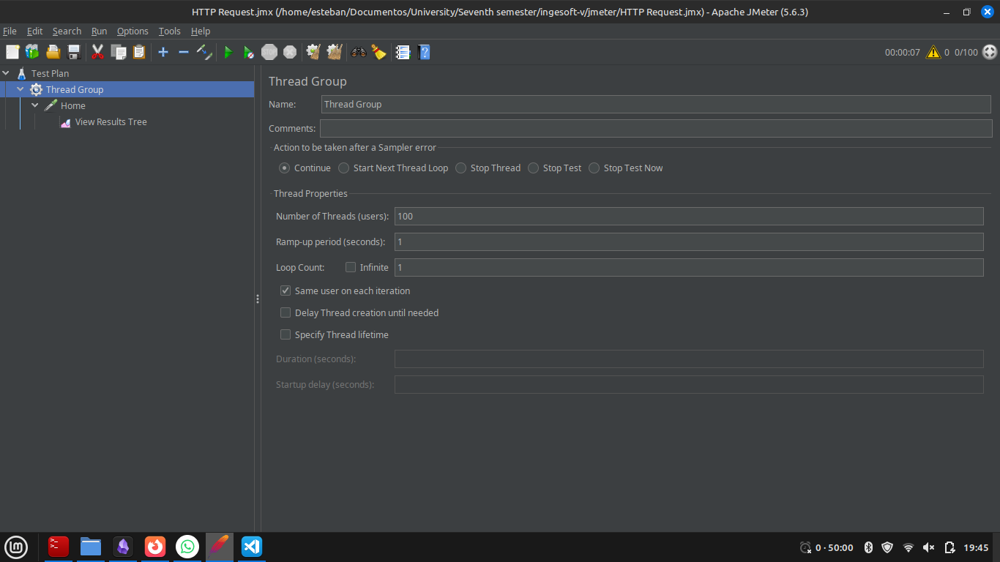

#### Result Visualization Components

JMeter provides multiple components for analyzing test results and monitoring system performance during test execution.

**View Results Tree** displays a comprehensive summary of all executed requests, including detailed information about request and response data, headers, and timing metrics. This component is particularly valuable for debugging individual requests and understanding the complete request-response cycle.

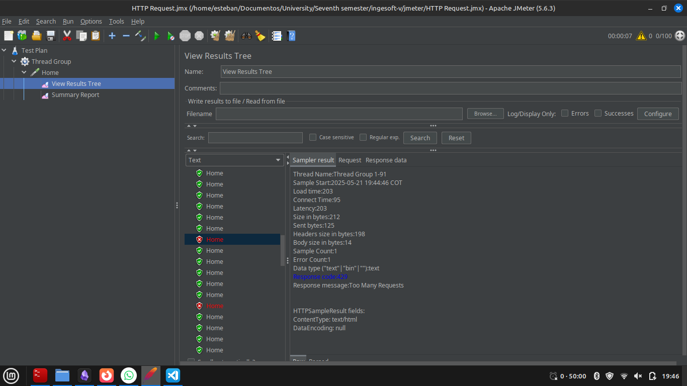

**Summary Report** presents aggregated performance metrics in tabular format, providing statistical analysis of test execution including average response times, throughput rates, error percentages, and other key performance indicators. These metrics enable stakeholders to assess overall system performance and identify trends.

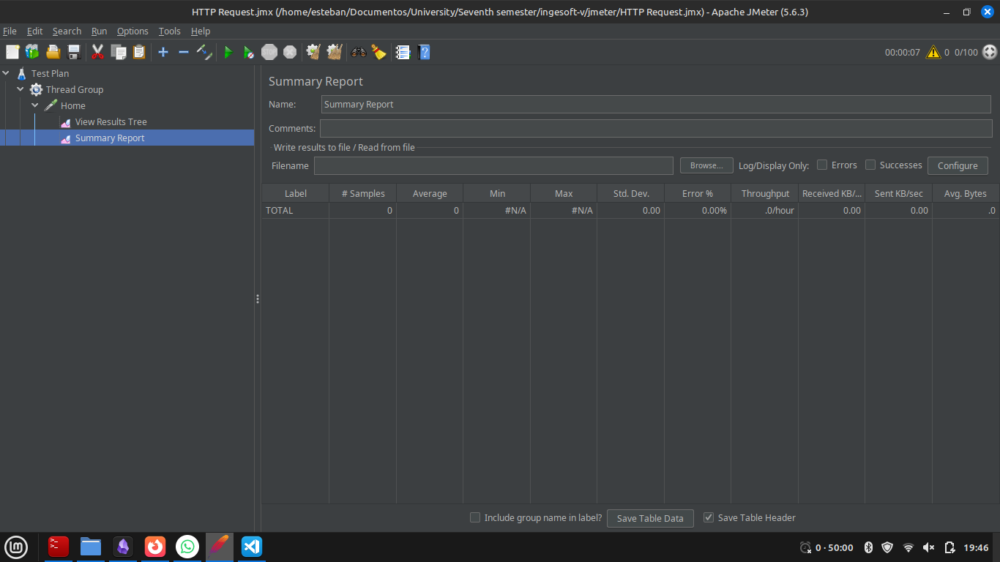

## Endpoint Testing with JMeter

This section demonstrates the practical implementation of endpoint testing through a real-world scenario involving flight ticket purchasing functionality.

### Use Case: Flight Ticket Purchase (POST Request)

The testing process begins with manual exploration of the target application to understand the underlying HTTP operations. In this example, the objective is to test flight availability queries from Philadelphia to Rome, requiring analysis of both the request endpoint and the request payload structure.

The initial step involves executing the desired action through the web interface to capture the HTTP request details, including the target URL, request method, headers, and body content.

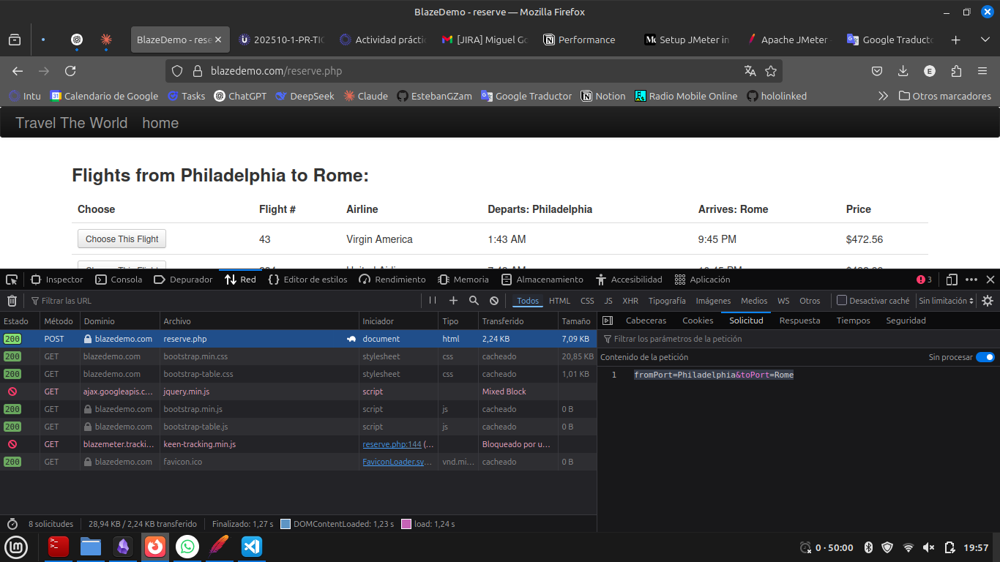

### JMeter Request Configuration

Following the analysis phase, the next step involves creating corresponding HTTP requests in JMeter with appropriate naming conventions that reflect the business functionality being tested.

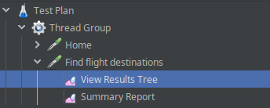

The HTTP Request sampler must be configured with the specific parameters identified during the analysis phase, including the request method, endpoint path, and request body data.

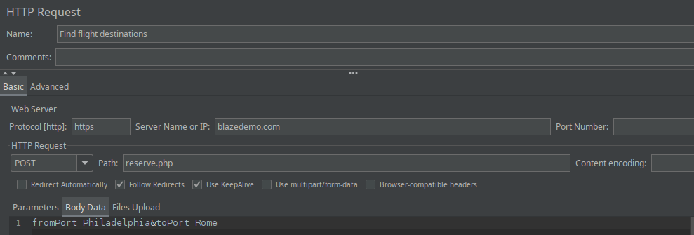

### Test Execution and Results Analysis

After configuring the request parameters, the test execution phase begins. The results provide detailed information about request success rates, response times, and any errors encountered during execution.

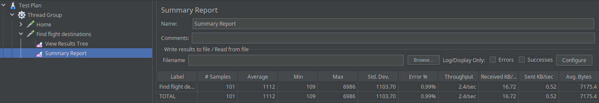

**Best Practice**: Listeners should be positioned at the Thread Group level to capture comprehensive flow information across all HTTP requests within the test plan. This approach provides complete visibility into the entire user journey and enables better correlation of performance metrics across different components.

## HTTP Request Defaults Configuration

JMeter's HTTP Request Defaults component enables centralized configuration management for common request parameters, promoting consistency and maintainability across test plans.

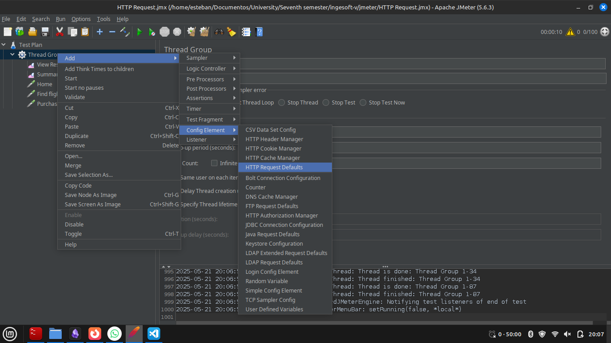

This component allows testers to define global parameters such as server names, port numbers, protocol schemes, and common headers that apply to all HTTP requests within the test plan. By configuring these defaults, individual HTTP Request samplers inherit the common settings, reducing configuration redundancy and simplifying test plan maintenance.

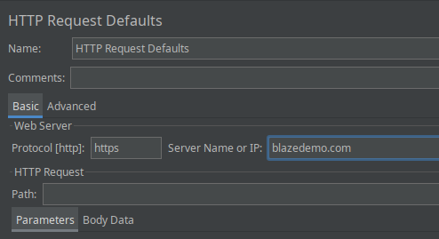

## BlazeMeter Browser Extension Integration

BlazeMeter provides a Chrome browser extension that facilitates automated test script generation through user interaction recording. This tool captures complete user workflows and generates corresponding JMeter test scripts.

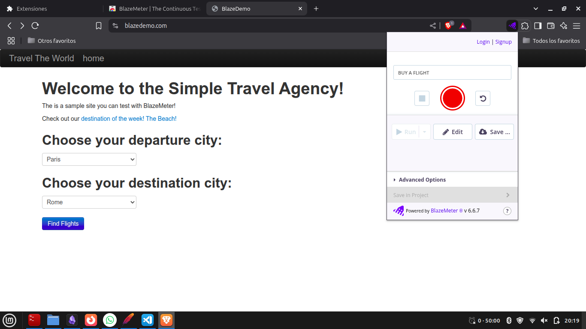

The extension records user actions performed in the browser and generates test scripts that can be exported in various formats, including YAML, for subsequent import into JMeter.

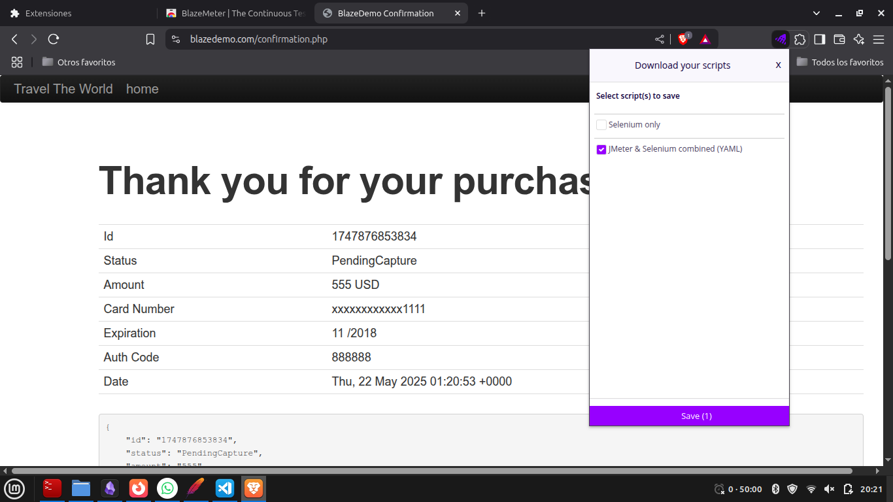

The generated script preserves the sequential flow of user interactions, enabling accurate reproduction of complex user journeys within JMeter test plans. This approach significantly reduces script development time while ensuring realistic user behavior simulation.

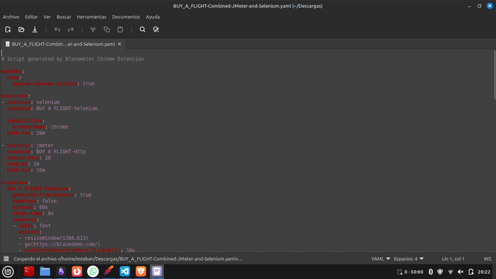

The exported files serve as foundational test scripts that can be directly imported into JMeter or used as templates for developing more sophisticated test scenarios.

## CSV Data Configuration for Data-Driven Testing

Data-driven testing enhances test coverage by executing the same test logic with multiple data sets. JMeter's CSV Data Set Config element enables integration of external data sources into test plans.

### CSV Data File Structure

The following example demonstrates a CSV file structure containing test data for flight search scenarios:

```
fromPort,toPort
Paris,Buenos Aires
Philadelphia,Rome
Boston,London
Portland,Berlin
San Diego,New York
Mexico City,Dublin
São Paolo,Cairo
```

### CSV Data Set Configuration

The CSV Data Set Config component must be properly configured to read the external data file and make the data available to HTTP Request samplers through variable references.

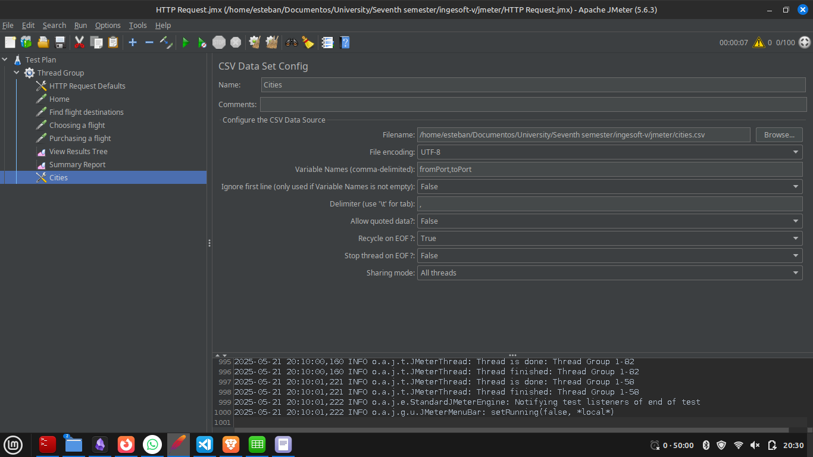

### Variable Integration in HTTP Requests

HTTP Request samplers reference CSV data through JMeter's variable notation syntax (`${variable_name}`), enabling dynamic parameter substitution during test execution.

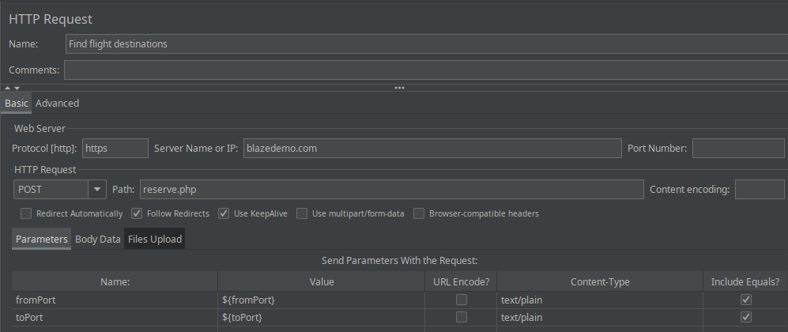

### Data-Driven Test Execution

When executed, the test plan iterates through each row of CSV data, creating separate requests with different parameter values. This approach validates system behavior across various input combinations.

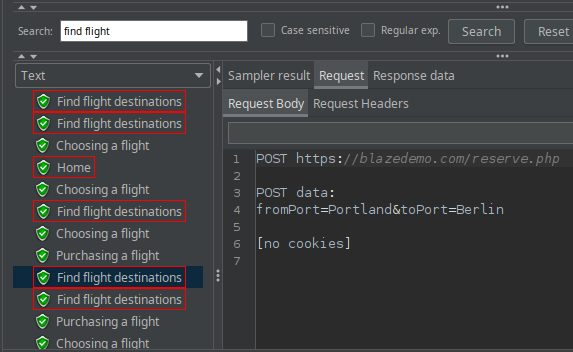
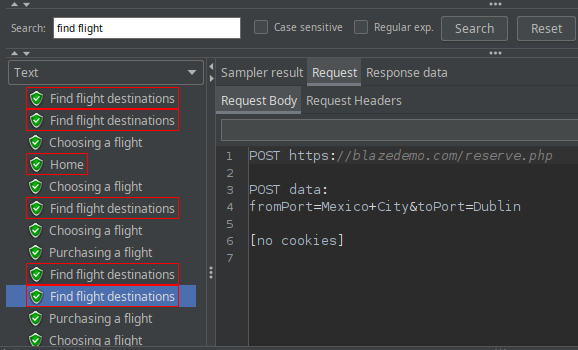

## Plugin Architecture and Extensions

JMeter's extensibility is enhanced through its plugin ecosystem, which provides additional functionality for specialized testing requirements and advanced result visualization.

### Plugin Manager Installation

The JMeter Plugin Manager must be downloaded and integrated with the JMeter installation to enable plugin management capabilities. This component provides access to a comprehensive library of community-developed extensions.

### Real-Time Monitoring Plugins

Specialized plugins enable real-time visualization of performance metrics during test execution, facilitating immediate identification of performance issues and supporting debugging activities. These visualization tools complement the standard reporting components by providing dynamic, graphical representations of system behavior.

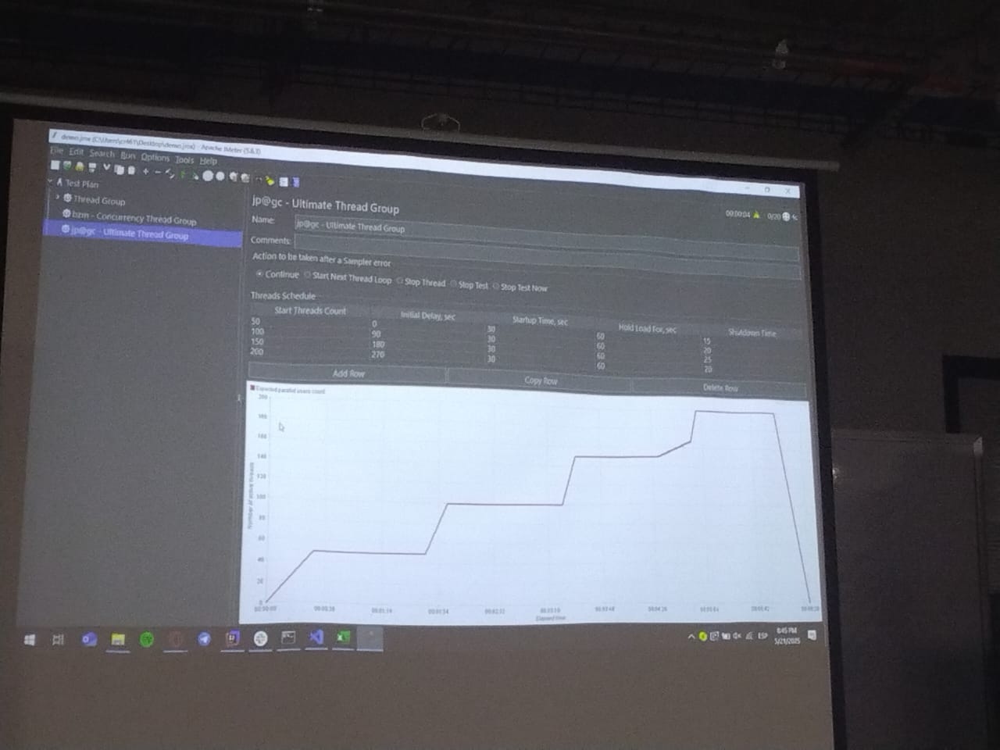

The primary purpose of real-time monitoring is to enable immediate feedback during test development and debugging phases. Production-quality performance testing typically relies on more sophisticated monitoring and analysis tools that provide comprehensive reporting capabilities.

## Testing Environment Considerations

### Production Environment Protection

Performance testing must never be conducted in production environments due to the risk of system disruption and potential service degradation. The high load levels generated during performance testing can overwhelm production systems, causing outages and negatively impacting end users.

### Dedicated Testing Environments

Organizations must establish dedicated performance testing environments that accurately mirror production configurations while providing safe isolation for load testing activities. These environments should include:

- Hardware specifications comparable to production systems
- Network configurations that simulate production latency and bandwidth constraints
- Data sets that represent realistic production data volumes
- Security configurations that match production requirements

Performance testing environments enable comprehensive system evaluation without compromising production stability, ensuring that performance optimization efforts do not introduce operational risks.
