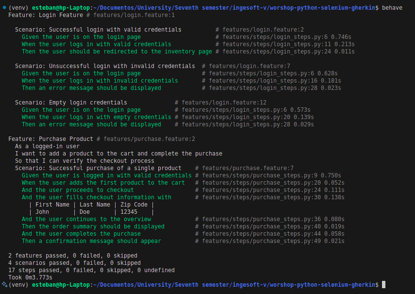

# **Automated Testing Workshop for saucedemo**

*Solution repository: https://github.com/EstebanGZam/worshop-python-selenium-gherkin.git*

## **1. Introduction**

This document details the implementation of an automated testing system for the [saucedemo](https://www.saucedemo.com/)
platform. The implementation encompasses correcting existing tests, implementing new test flows, and integrating with
CI/CD. The project utilized the following technologies:

- **Selenium WebDriver** for browser automation
- **Behave** as the BDD framework
- **GitHub Actions** for continuous integration
- **Page Object Model Pattern** for maintainability

## **2. Environment Configuration**

### **2.1. Initial Setup**

The implementation began with forking the repository https://github.com/chumbi27escobar3/worshop-python-selenium-gherkin
and cloning it locally. A Python virtual environment was configured to manage dependencies:

```bash
python -m venv venv
source venv/bin/activate  # Linux/Mac
.\venv\Scripts\activate   # Windows
```

### **2.2. Dependency Installation**

The necessary packages were installed using pip:

```bash
pip install selenium behave behave-html-formatter
pip freeze > requirements.txt
```

## **3. Troubleshooting Existing Tests**

### **3.1. Problem Identification**

The login scenario was failing due to two main issues:

1. The absence of the `InventoryPage` class required to validate redirections
2. Outdated selectors in the inventory page

### **3.2. Implementation of Solution**

#### **3.2.1. Development of InventoryPage Class**

The `InventoryPage` class was developed with key methods:

```python
from selenium.webdriver.common.by import By
from pages.base_page import BasePage

class InventoryPage(BasePage):
    APP_LOGO = (By.CLASS_NAME, "app_logo")
    ADD_TO_CART_BUTTON = (By.XPATH, "//button[contains(@id, 'add-to-cart')][1]")
    
    def is_inventory_page_displayed(self):
        return self.find_element(self.APP_LOGO)
```

## **4. Implementation of Purchase Flow Tests**

### **4.1. Gherkin Scenario Design**

A complete purchase flow was implemented following the BDD pattern with the following scenario:

```gherkin
Feature: Purchase Product
  As a logged-in user
  I want to add a product to the cart and complete the purchase
  So that I can verify the checkout process

  Scenario: Successful purchase of a single product
    Given the user is logged in with valid credentials
    When the user adds the first product to the cart
    And the user proceeds to checkout
    And the user fills checkout information with:
      | First Name | Last Name | Zip Code |
      | John       | Doe       | 12345    |
    And the user continues to the overview
    Then the order summary should be displayed
    And the user completes the purchase
    Then a confirmation message should appear
```

### **4.2. Technical Implementation**

#### **4.2.1. Required File Structure**

```
features/
├── purchase.feature          # Gherkin file (existing)
└── steps/
    └── purchase_steps.py     # Step implementation (new)

pages/
├── cart_page.py              # New
├── checkout_page.py          # New
└── confirmation_page.py      # New
```

### **4.3. Validation Flow**

The test follows a structured validation flow:

1. **Precondition**: User is authenticated
2. **Actions**:
    - Add product to cart
    - Navigate through checkout
    - Complete shipping information
3. **Validations**:
    - Order summary display verification
    - Post-purchase confirmation message validation

### **4.4. Implementation Considerations**

- **Test Data**: Gherkin tables allow for multiple data sets
- **POM Pattern**: Each page has its corresponding class
- **Reusability**: Login steps leverage existing implementation

### **4.5. Result of the execution of the automated tests**



## **5. GitHub Actions Automation**

### **5.1. Workflow Configuration**

The following CI pipeline was implemented:

```yaml
name: Python Selenium Tests

on:
  push:
    branches: [ main ]
  pull_request:
    branches: [ main ]
  workflow_dispatch:

jobs:
  test:
    runs-on: ubuntu-latest
    timeout-minutes: 10

    steps:
      - name: Checkout code
        uses: actions/checkout@v4

      - name: Set up Python 3.12
        uses: actions/setup-python@v4
        with:
          python-version: "3.12"
          cache: "pip"

      - name: Verify Chrome & ChromeDriver (Pre-installed)
        run: |
          google-chrome --version  # Verify Chrome
          chromedriver --version   # Verify ChromeDriver

      - name: Install Python dependencies
        run: |
          python -m pip install --upgrade pip
          pip install -r requirements.txt behave-html-formatter --no-cache-dir

      - name: Run tests with Behave
        run: |
          mkdir -p reports  # Create directory for reports
          behave -f behave_html_formatter:HTMLFormatter -o reports/test-report.html
        env:
          HEADLESS: "true"
          PYTHONUNBUFFERED: "1"

      - name: Upload test report
        if: always()
        uses: actions/upload-artifact@v4
        with:
          name: behave-test-report
          path: reports/test-report.html
```

The implemented workflow executes automated tests in a CI/CD environment with the following key characteristics:

#### **Execution Triggers**

- **Push** to the `main` branch
- **Pull requests** targeting `main`
- **Manual execution** through `workflow_dispatch`

#### **Job Configuration**

- **Environment**: Ubuntu Latest
- **Timeout**: 10 minutes (prevents infinite executions)

#### **Key Steps**

1. **Code Checkout**
    - Downloads the latest version of the repository

2. **Python 3.12 Configuration**
    - Uses pip cache to optimize future installations

3. **Chrome/ChromeDriver Verification**
    - Confirms browser dependencies are available
   ```bash
   google-chrome --version
   chromedriver --version
   ```

4. **Dependency Installation**
    - Updates pip and installs packages from `requirements.txt`
    - Includes HTML formatter for reports

5. **Test Execution**
    - Creates `reports` directory to store results
    - Executes tests in headless mode:
      ```bash
      behave -f behave_html_formatter:HTMLFormatter -o reports/test-report.html
      ```
    - Environment variables:
        - `HEADLESS="true"`: Execution without graphical interface
        - `PYTHONUNBUFFERED="1"`: Displays logs in real time

6. **Report Upload**
    - Stores the HTML file as a downloadable artifact, **even if tests fail** (`if: always()`).

## **6. Final Project Structure**

```
.
├── .github/
│   └── workflows/
│       └── tests.yml
├── features/
│   ├── environment.py
│   ├── login.feature
│   ├── purchase.feature
│   └── steps/
│       ├── login_steps.py
│       └── purchase_steps.py
├── pages/
│   ├── base_page.py
│   ├── cart_page.py
│   ├── checkout_page.py
│   ├── confirmation_page.py
│   ├── inventory_page.py
│   └── login_page.py
└── requirements.txt
```

## **7. Conclusion**

The implementation successfully achieved:

1. **Effective correction** of the initial login scenario
2. **Complete coverage** of the purchase flow
3. **Functional continuous integration**
4. **Enhanced maintainability** through POM

The system now provides a solid foundation for scaling tests as the application grows.