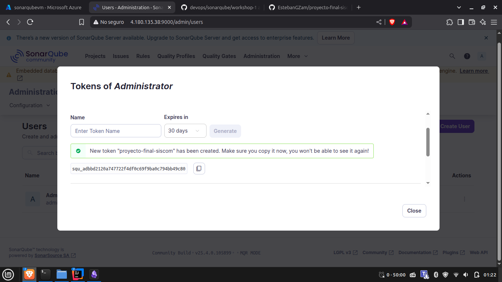

# SonarQube Workshop 1: Integrating Static Code Analysis into DevOps

## Introduction

This document outlines the implementation of SonarQube in a development environment to demonstrate how static code
analysis and continuous inspection can be seamlessly integrated into the DevOps lifecycle. The primary objective is to
enhance code quality and maintainability through automated code analysis. The workshop showcases the complete setup
process, from infrastructure provisioning with Terraform to configuration management with Ansible and finally the
integration with GitHub Actions for continuous code quality monitoring.

## Infrastructure Setup

### Terraform Configuration

The infrastructure for this workshop reused an existing Terraform configuration from a previous project:
https://github.com/EstebanGZam/devops/tree/main/terraform/workshop-2/mario-bros-vm-tf. To properly support SonarQube
services, it was necessary to add a security rule to enable communication on port 9000 in
the [azurerm_network_security_group](https://github.com/EstebanGZam/devops/blob/main/terraform/workshop-2/mario-bros-vm-tf/modules/network/main.tf),
which is the default port for
SonarQube:

```
security_rule {
  name                       = "sonarqube_http_rule"
  priority                   = 120
  direction                  = "Inbound"
  access                     = "Allow"
  protocol                   = "Tcp"
  source_port_range          = "*"
  destination_port_range     = "9000"
  source_address_prefix      = "*"
  destination_address_prefix = "*"
}
```

This inbound security rule is critical as it allows external traffic to reach the SonarQube server, making it accessible
for both developers and integration with CI/CD pipelines.


## Ansible Configuration

After deploying the virtual machine with Terraform, Ansible was used to configure the environment and deploy SonarQube
using Docker containers. This approach ensures that the deployment is both reproducible and easily maintainable.

### Directory Structure

The following directory structure was created for the Ansible configuration:

```
.
├── ansible.cfg
├── inventory
│   └── hosts.ini
├── playbooks
│   └── deploy_sonarqube.yml
└── roles
    ├── docker_install
    │   └── tasks
    │       └── main.yml
    └── sonarqube
        ├── files
        │   └── docker-compose.yml
        └── tasks
            └── main.yml
```

This structure follows Ansible best practices, separating inventory, playbooks, and roles for better organization and
reusability.

### Inventory Configuration

The `inventory/hosts.ini` file contains the target host information for Ansible deployment:

```
[azure_vm]
4.180.135.38 ansible_user='adminuser' ansible_ssh_pass='Password*#123'
```

This specifies the IP address of the Azure VM and the credentials needed for SSH access. In production environments, it
is recommended to use SSH keys instead of passwords for enhanced security.

### Playbook Configuration

The `playbooks/deploy_sonarqube.yml` playbook orchestrates the deployment by applying the necessary roles:

```
- hosts: azure_vm
  become: yes
  roles:
    - docker_install
    - sonarqube
```

This playbook targets the Azure VM defined in the inventory and applies two roles: one to install Docker and another to
deploy SonarQube. The `become: yes` directive ensures that tasks are executed with elevated privileges.

### Docker Installation Role

The `roles/docker_install/tasks/main.yml` file contains tasks for installing Docker on the target machine:

```
- name: Install Docker dependencies
  apt:
    name:
      - apt-transport-https
      - ca-certificates
      - curl
      - software-properties-common
    state: present
    update_cache: yes

- name: Add Docker's official GPG key
  ansible.builtin.apt_key:
    url: https://download.docker.com/linux/ubuntu/gpg
    state: present

- name: Add Docker repository
  ansible.builtin.apt_repository:
    repo: deb [arch=amd64] https://download.docker.com/linux/ubuntu bionic stable
    state: present

- name: Install Docker CE
  apt:
    name: docker-ce
    state: present
    update_cache: yes
```

These tasks ensure that all necessary dependencies are installed, Docker's GPG key is added for package verification,
the Docker repository is configured, and finally, Docker CE is installed. This approach ensures a consistent Docker
installation process across different environments.

### SonarQube Deployment Role

The SonarQube deployment is managed through Docker Compose. The `roles/sonarqube/files/docker-compose.yml` file defines
the services:

```
services:
  sonarqube:
    image: sonarqube
    ports:
      - "9000:9000"
    networks:
      - sonarnet
    environment:
      - SONARQUBE_JDBC_URL=jdbc:postgresql://db:5432/sonar
      - SONARQUBE_JDBC_USERNAME=sonar
      - SONARQUBE_JDBC_PASSWORD=sonar
    volumes:
      - sonarqube_conf:/opt/sonarqube/conf
      - sonarqube_data:/opt/sonarqube/data
      - sonarqube_extensions:/opt/sonarqube/extensions
      - sonarqube_bundled-plugins:/opt/sonarqube/lib/bundled-plugins

  db:
    image: postgres
    networks:
      - sonarnet
    environment:
      - POSTGRES_USER=sonar
      - POSTGRES_PASSWORD=sonar
    volumes:
      - postgresql:/var/lib/postgresql
      - postgresql_data:/var/lib/postgresql/data

networks:
  sonarnet:
    driver: bridge

volumes:
  sonarqube_conf:
  sonarqube_data:
  sonarqube_extensions:
  sonarqube_bundled-plugins:
  postgresql:
  postgresql_data:
```

This configuration establishes two Docker containers:

1. A SonarQube server container exposed on port 9000
2. A PostgreSQL database container to store SonarQube data

The services are connected through a dedicated Docker network, and persistent volumes are defined to ensure data
preservation across container restarts. This architecture follows best practices for containerized applications by
separating services and ensuring data persistence.

The tasks for deploying SonarQube are defined in `roles/sonarqube/tasks/main.yml`:

```
- name: Create directory for SonarQube
  file:
    path: /opt/sonarqube
    state: directory

- name: Copy docker-compose.yml
  copy:
    src: files/docker-compose.yml
    dest: /opt/sonarqube/docker-compose.yml

- name: Start containers
  command: docker compose up -d
  args:
    chdir: /opt/sonarqube
```

These tasks create a directory for SonarQube configurations, copy the Docker Compose file to the target machine, and
start the containers in detached mode.

## Deployment Execution

With the Ansible configuration completed, the deployment is executed using the following command:

```
ansible-playbook playbooks/deploy_sonarqube.yml
```


This command applies the configured playbook to the target hosts, installing Docker and deploying SonarQube with its
associated PostgreSQL database.

## SonarQube Initial Configuration

### Accessing the Server

Once the deployment is complete, the SonarQube server becomes accessible through a web browser at the VM's IP address on
port 9000:


### Initial Authentication

By default, SonarQube is configured with username "admin" and password "admin". Upon first login, it is necessary to
change the default password to enhance security. This is a critical security practice as default credentials are widely
known and pose a significant security risk if left unchanged.


After successfully changing the password, the main SonarQube dashboard is presented:


## GitHub Integration

To integrate SonarQube with a GitHub repository, several configuration steps are required. The repository used for the
workshop is as follows: https://github.com/EstebanGZam/proyecto-final-siscom

### Token Generation

First, it is necessary to generate a token in SonarQube that will be used for authentication from GitHub Actions:

1. Navigate to Administration > Security > Users
2. Select "Update Tokens"

   

3. Generate a new token using a descriptive name (in this case, the project name was used):



### GitHub Repository Configuration

The generated token and SonarQube server URL need to be configured as secrets in the GitHub repository:


These secrets are essential for the GitHub Actions workflow to communicate securely with the SonarQube server. The
`SONAR_TOKEN` provides authentication, while the `SONAR_HOST_URL` specifies the location of the SonarQube instance.

### GitHub Actions Workflow Configuration

A GitHub Actions workflow is created to automate the code analysis process on each push to the main branch or on pull
requests:

```
name: SonarQube Analysis with Maven

on:
  push:
    branches: [ main ]
  pull_request:
    types: [ opened, synchronize, reopened ]

jobs:
  sonar-analysis:
    name: SonarQube Scan
    runs-on: ubuntu-latest

    services:
      postgres:
        image: postgres:latest
        env:
          POSTGRES_DB: clinic_test
          POSTGRES_USER: test_user
          POSTGRES_PASSWORD: test_password
        ports:
          - 5436:5432

    steps:
      - name: Checkout code
        uses: actions/checkout@v4
        with:
          fetch-depth: 0  # Necesario para análisis completo de SonarQube

      - name: Set up JDK 17
        uses: actions/setup-java@v3
        with:
          java-version: '17'
          distribution: 'temurin'

      - name: Cache Maven dependencies
        uses: actions/cache@v3
        with:
          path: ~/.m2/repository
          key: ${{ runner.os }}-maven-${{ hashFiles('**/pom.xml') }}
          restore-keys: |
            ${{ runner.os }}-maven-

      - name: Run tests and generate JaCoCo report
        run: |
          mvn clean verify jacoco:report

      - name: SonarQube Scan
        env:
          SONAR_TOKEN: ${{ secrets.SONAR_TOKEN }}
          SONAR_HOST_URL: ${{ secrets.SONAR_HOST_URL }}
        run: |
          mvn sonar:sonar \
            -Dsonar.projectKey=onco-logic-clinic \
            -Dsonar.projectName="OncoLogic Clinic" \
            -Dsonar.java.binaries=target/classes \
            -Dsonar.coverage.jacoco.xmlReportPaths=target/site/jacoco/jacoco.xml \
            -Dsonar.host.url=$SONAR_HOST_URL \
            -Dsonar.login=$SONAR_TOKEN \
            -Dsonar.sourceEncoding=UTF-8
```

This workflow:

1. Establishes a PostgreSQL service container for test execution
2. Checks out the code repository with sufficient history for analysis
3. Sets up Java 17 for Maven build operations
4. Implements caching for Maven dependencies to improve workflow execution speed
5. Runs tests and generates JaCoCo coverage reports
6. Executes the SonarQube analysis using Maven's Sonar plugin

The configuration specifies parameters such as project key, project name, locations of compiled code and coverage
reports, and authentication information for the SonarQube server.

## Verification of Integration

After committing the GitHub Actions workflow configuration to the repository, the workflow becomes active:


The SonarQube dashboard now displays the analyzed project:


Detailed code quality metrics, including test coverage and other statistics, are available within the project dashboard:


## Conclusion

This workshop successfully demonstrates the complete process of integrating SonarQube into a DevOps workflow. From
infrastructure provisioning to continuous code quality monitoring, each step has been carefully implemented to ensure a
robust, maintainable solution. By following the practices outlined in this documentation, development teams can
significantly improve their code quality and maintainability through automated static code analysis.

The integration with GitHub Actions demonstrates how code quality checks can be automatically triggered as part of the
development process, providing immediate feedback to developers and maintaining high quality standards across the
codebase.