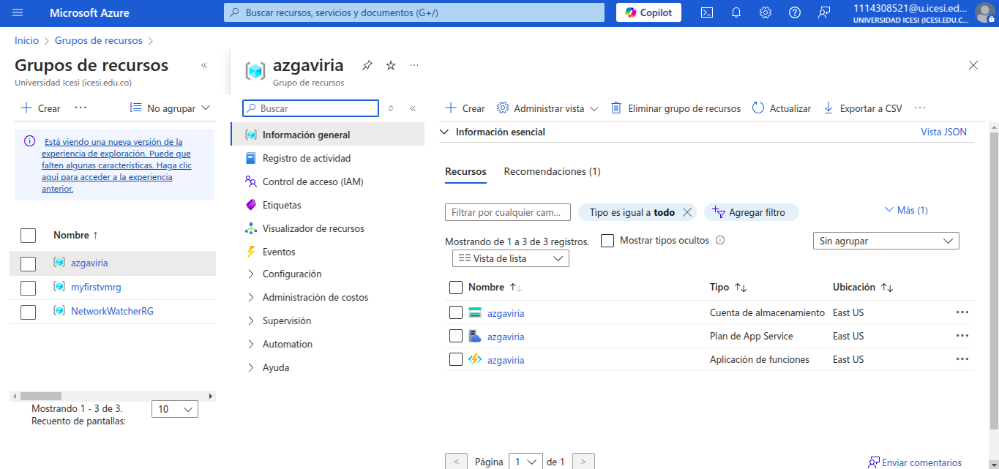

# Implementation Guide with Terraform on Azure

---

## Part 1: Deploying an Azure Function

### Objective

This section describes the process for deploying an Azure Function using Terraform. It details the necessary resources,
such as the resource group, storage account, service plan, and function app. Finally, the required commands to deploy
the infrastructure on Azure and validate its correct operation are presented.

### Project Description

This first part of the exercise was carried out based on the repository available at the following URL:
`https://github.com/ChristianFlor/azfunction-tf.git`.

The implementation is based on a set of Terraform files that define the resources in Azure (can be found in the
`azfunction-tf` folder). An educational Azure
subscription will be used, so it is necessary to define the subscription key in a `terraform.tfvars` file (This key is
obtained through the command `az account show`).

### Files and Configuration

#### `main.tf`

- **Azure Provider:** Configures the Azure provider with the specified subscription ID.

```hcl
provider "azurerm" {
  features {}
  subscription_id = var.subscription_id
}
```

- **Resource Group:** Creates a resource group to contain all related resources.

```hcl
resource "azurerm_resource_group" "rg" {
  name     = var.name_function
  location = var.location
}
```

- **Storage Account:** Defines a storage account for function app storage and logging.

```hcl
resource "azurerm_storage_account" "sa" {
  name                     = var.name_function
  resource_group_name      = azurerm_resource_group.rg.name
  location                 = azurerm_resource_group.rg.location
  account_tier             = "Standard"
  account_replication_type = "LRS"
}
```

- **Service Plan:** Defines the hosting plan for the function app, specifying OS type and pricing tier.

```hcl
resource "azurerm_service_plan" "sp" {
  name                = var.name_function
  resource_group_name = azurerm_resource_group.rg.name
  location            = azurerm_resource_group.rg.location
  os_type             = "Windows"
  sku_name            = "B1"
}
```

- **Function App:** Deploys an Azure Function App linked to the storage account and service plan.

```hcl
resource "azurerm_windows_function_app" "wfa" {
  name                = var.name_function
  resource_group_name = azurerm_resource_group.rg.name
  location            = azurerm_resource_group.rg.location

  storage_account_name       = azurerm_storage_account.sa.name
  storage_account_access_key = azurerm_storage_account.sa.primary_access_key
  service_plan_id            = azurerm_service_plan.sp.id

  site_config {
    application_stack {
      node_version = "~18"
    }
  }
}
```

- **Function within the Azure Function App:** Defines a specific function inside the function app with HTTP triggers.

```hcl
resource "azurerm_function_app_function" "faf" {
  name            = var.name_function
  function_app_id = azurerm_windows_function_app.wfa.id
  language        = "Javascript"

  file {
    name = "index.js"
    content = file("example/index.js")
  }

  test_data = jsonencode({
    "name" = "Azure"
  })

  config_json = jsonencode({
    "bindings" : [
      {
        "authLevel" : "anonymous",
        "type" : "httpTrigger",
        "direction" : "in",
        "name" : "req",
        "methods" : [
          "get",
          "post"
        ]
      },
      {
        "type" : "http",
        "direction" : "out",
        "name" : "res"
      }
    ]
  })
}
```

#### `outputs.tf`

Defines the deployed function's URL:

```hcl
output "url" {
  value       = azurerm_function_app_function.faf.invocation_url
  sensitive   = false
  description = "URL of the deployed Azure Function"
}
```

#### `variables.tf`

Defines the configuration variables:

```hcl
variable "subscription_id" {
  description = "The subscription ID to use for Azure resources."
  type        = string
}

variable "name_function" {
  type        = string
  description = "Name Function"
}

variable "location" {
  type        = string
  default     = "West Europe"
  description = "Location"
}
```

#### `terraform.tfvars`

Example of variable configuration:

```hcl
subscription_id = "YOUR_ID"
name_function   = "azgaviria"
location        = "East US"
```

### Deployment Steps

1. Initialize Terraform:
   ```bash
   terraform init
   ```
   
2. Validate configuration:
   ```bash
   terraform validate
   ```
   
3. Review changes before deployment:
   ```bash
   terraform plan
   ```
   
4. Apply the changes:
   ```bash
   terraform apply
   ```
   Once this command is executed, it is possible to see the Azure Function in operation with everything defined in the
   created Terraform file.   
   
5. Verify the URL generated by Azure and append `/api/functionName` to execute the function.
   

To delete the infrastructure:

```bash
terraform destroy
```

---

## Part 2: Deploying a Linux Virtual Machine

### Objective

This section describes the process of deploying a Linux virtual machine on Azure using Terraform. It details the
necessary infrastructure components, such as the resource group, virtual network, subnet, network interface, and the
virtual machine itself. Additionally, it explains how to enable public access by incorporating a public IP, a network
security group, and associating the security group with the network interface.

### Project Description

This implementation follows a Terraform-based approach for provisioning a Linux virtual machine in Azure (it can
be found in the `myfirstvm-tf` folder). The configuration includes essential resources such as a virtual network,
subnet, network interface, and the virtual machine itself. Additionally, networking components like a public IP address
and a network security group with SSH access rules are integrated to ensure proper connectivity and security.

### Files and Configuration

#### `main.tf`

- **Azure Provider**: Configures the provider for managing Azure resources.

```hcl
provider "azurerm" {
  features {}
  subscription_id = var.subscription_id
}
```

- **Resource Group**: Defines a resource group to encapsulate all related resources.

```hcl
resource "azurerm_resource_group" "rg" {
  name     = var.resource_group_name
  location = var.location
}
```

- **Virtual Network and Subnet**: Creates a virtual network with a defined IP address space and a subnet within it.

```hcl
resource "azurerm_virtual_network" "vnet" {
  name                = var.virtual_network_name
  address_space = ["10.0.0.0/16"]
  location            = azurerm_resource_group.rg.location
  resource_group_name = azurerm_resource_group.rg.name
}

resource "azurerm_subnet" "subnet" {
  name                 = var.subnet_name
  resource_group_name  = azurerm_resource_group.rg.name
  virtual_network_name = azurerm_virtual_network.vnet.name
  address_prefixes = ["10.0.2.0/24"]
}
```

- **Public IP**: Creates a public IP address for external access.

```hcl
resource "azurerm_public_ip" "public_ip" {
  name                = var.public_ip_name
  location            = azurerm_resource_group.rg.location
  resource_group_name = azurerm_resource_group.rg.name
  allocation_method   = "Static"
}
```

- **Network Interface**: Establishes a network interface that links the virtual machine to the subnet and assigns a
  public IP.

```hcl
resource "azurerm_network_interface" "nic" {
  name                = var.network_interface_name
  location            = azurerm_resource_group.rg.location
  resource_group_name = azurerm_resource_group.rg.name

  ip_configuration {
    name                          = "internal"
    subnet_id                     = azurerm_subnet.subnet.id
    private_ip_address_allocation = "Dynamic"
    public_ip_address_id          = azurerm_public_ip.public_ip.id
  }
}
```

- **Linux Virtual Machine**: Configures a Linux-based virtual machine, specifying its size, administrator credentials,
  and OS image.

```hcl
resource "azurerm_linux_virtual_machine" "vm" {
  name                = var.vm_name
  resource_group_name = azurerm_resource_group.rg.name
  location            = azurerm_resource_group.rg.location
  size                = var.vm_size
  admin_username      = var.admin_username
  admin_password      = var.admin_password
  network_interface_ids = [azurerm_network_interface.nic.id]

  os_disk {
    caching              = "ReadWrite"
    storage_account_type = "Standard_LRS"
  }

  source_image_reference {
    publisher = "Canonical"
    offer     = "0001-com-ubuntu-server-jammy"
    sku       = "22_04-lts"
    version   = "latest"
  }

  disable_password_authentication = false
  provision_vm_agent              = true
}
```

- **Network Security Group**: Creates security rules to allow SSH access.

```hcl
resource "azurerm_network_security_group" "nsg" {
  name                = var.network_security_group_name
  location            = azurerm_resource_group.rg.location
  resource_group_name = azurerm_resource_group.rg.name

  security_rule {
    name                       = "ssh_rule"
    priority                   = 100
    direction                  = "Inbound"
    access                     = "Allow"
    protocol                   = "Tcp"
    source_port_range          = "*"
    destination_port_range     = "22"
    source_address_prefix      = "*"
    destination_address_prefix = "*"
  }
}
```

- **Associate Security Group with Network Interface**

```hcl
resource "azurerm_network_interface_security_group_association" "nic_nsg" {
  network_interface_id      = azurerm_network_interface.nic.id
  network_security_group_id = azurerm_network_security_group.nsg.id
}
```

#### `variables.tf`

Defines reusable variables for configuration.

```hcl
# variables.tf

variable "subscription_id" {
  type        = string
  description = "The subscription ID to use for Azure resources."
}

variable "location" {
  type        = string
  description = "The location/region where the resources will be created."
  default     = "West Europe"
}

variable "resource_group_name" {
  type        = string
  description = "The name of the resource group."
}

variable "virtual_network_name" {
  type        = string
  description = "The name of the virtual network."
}

variable "subnet_name" {
  type        = string
  description = "The name of the subnet."
}

variable "network_interface_name" {
  type        = string
  description = "The name of the network interface."
}

variable "vm_name" {
  type        = string
  description = "The name of the virtual machine."
}

variable "vm_size" {
  type        = string
  description = "The size of the virtual machine."
  default     = "Standard_F2"
}

variable "admin_username" {
  type        = string
  description = "The admin username for the virtual machine."
}

variable "admin_password" {
  type        = string
  description = "The admin password for the virtual machine."
  sensitive   = true
}

variable "network_security_group_name" {
  type        = string
  description = "The name of the network security group."
}

variable "public_ip_name" {
  type        = string
  description = "The name of the public IP address."
}
```

#### `outputs.tf`

Defines output values to retrieve deployed resources' information.

```hcl
# outputs.tf

output "resource_group_name" {
  value = azurerm_resource_group.rg.name
}

output "virtual_network_name" {
  value = azurerm_virtual_network.vnet.name
}

output "subnet_name" {
  value = azurerm_subnet.subnet.name
}

output "public_ip_address" {
  value = azurerm_public_ip.public_ip.ip_address
}

output "vm_name" {
  value = azurerm_linux_virtual_machine.vm.name
}

output "vm_admin_username" {
  value = var.admin_username
}

output "vm_admin_password" {
  value     = var.admin_password
  sensitive = true
}
```

#### `terraform.tfvars`

Example of variable configuration:

```hcl
subscription_id             = "YOUR_ID"
resource_group_name         = "myfirstvmrg"
virtual_network_name        = "myfirstvmvnet"
subnet_name                 = "myfirstvmsubnet"
network_interface_name      = "myfirstvmnic"
vm_name                     = "myfirstvm"
vm_size                     = "Standard_F2"
admin_username              = "adminuser"
admin_password              = "Password*#123"
network_security_group_name = "myfirstvmnsg"
public_ip_name              = "myfirstvmpublicip"
```

### Deployment Steps

1. Initialize Terraform:
   ```bash
   terraform init
   ```
   
2. Validate configuration:
   ```bash
   terraform validate
   ```
   
3. Review planned changes:
   ```bash
   terraform plan
   ```
   
   
4. Apply the configuration to deploy resources:
   ```bash
   terraform apply
   ```
   
   
   After execution, the virtual machine and its associated resources will be created:  
   
   These resources will be publicly accessible via SSH using the IP address, which can be checked in the Azure Portal:  
   
   or by running the command:
   ```
   terraform output public_ip
   ```

SSH access can be established as follows:  

To delete the infrastructure:

```bash
terraform destroy
```
