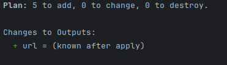

# Implementation Guide with Terraform on Azure

## Part 1: Deploying an Azure Function

### Objective

This document describes the process for deploying an Azure Function using Terraform. It details the necessary resources,
such as the resource group, storage account, service plan, and function app. Finally, the required commands to deploy
the infrastructure on Azure and validate its correct operation are presented.

### Project Description

This first part of the exercise was carried out based on the repository available at the following URL:
`https://github.com/ChristianFlor/azfunction-tf.git`.
The implementation is based on a set of Terraform files that define the resources in Azure. An educational Azure
subscription will be used, so it is necessary to define the subscription key in a `terraform.tfvars` file (This key is
obtained through the command `az account show`).

### Files and Configuration

#### `main.tf`

- **Azure Provider:** Configures the Azure provider with the specified subscription ID.

```hcl
provider "azurerm" {
  features {}
  subscription_id = var.subscription_id
}
```

- **Resource Group:** Creates a resource group to contain all related resources.

```hcl
resource "azurerm_resource_group" "rg" {
  name     = var.name_function
  location = var.location
}
```

- **Storage Account:** Defines a storage account for function app storage and logging.

```hcl
resource "azurerm_storage_account" "sa" {
  name                     = var.name_function
  resource_group_name      = azurerm_resource_group.rg.name
  location                 = azurerm_resource_group.rg.location
  account_tier             = "Standard"
  account_replication_type = "LRS"
}
```

- **Service Plan:** Defines the hosting plan for the function app, specifying OS type and pricing tier.

```hcl
resource "azurerm_service_plan" "sp" {
  name                = var.name_function
  resource_group_name = azurerm_resource_group.rg.name
  location            = azurerm_resource_group.rg.location
  os_type             = "Windows"
  sku_name            = "B1"
}
```

- **Function App:** Deploys an Azure Function App linked to the storage account and service plan.

```hcl
resource "azurerm_windows_function_app" "wfa" {
  name                = var.name_function
  resource_group_name = azurerm_resource_group.rg.name
  location            = azurerm_resource_group.rg.location

  storage_account_name       = azurerm_storage_account.sa.name
  storage_account_access_key = azurerm_storage_account.sa.primary_access_key
  service_plan_id            = azurerm_service_plan.sp.id

  site_config {
    application_stack {
      node_version = "~18"
    }
  }
}
```

- **Function within the Azure Function App:** Defines a specific function inside the function app with HTTP triggers.

```hcl
resource "azurerm_function_app_function" "faf" {
  name            = var.name_function
  function_app_id = azurerm_windows_function_app.wfa.id
  language        = "Javascript"

  file {
    name = "index.js"
    content = file("example/index.js")
  }

  test_data = jsonencode({
    "name" = "Azure"
  })

  config_json = jsonencode({
    "bindings" : [
      {
        "authLevel" : "anonymous",
        "type" : "httpTrigger",
        "direction" : "in",
        "name" : "req",
        "methods" : [
          "get",
          "post"
        ]
      },
      {
        "type" : "http",
        "direction" : "out",
        "name" : "res"
      }
    ]
  })
}
```

#### `outputs.tf`

Defines the deployed function's URL:

```hcl
output "url" {
  value       = azurerm_function_app_function.faf.invocation_url
  sensitive   = false
  description = "URL of the deployed Azure Function"
}
```

#### `variables.tf`

Defines the configuration variables:

```hcl
variable "subscription_id" {
  description = "The subscription ID to use for Azure resources."
  type        = string
}

variable "name_function" {
  type        = string
  description = "Name Function"
}

variable "location" {
  type        = string
  default     = "West Europe"
  description = "Location"
}
```

#### `terraform.tfvars`

Example of variable configuration:

```hcl
subscription_id = "ID"
name_function   = "azgaviria"
location        = "East US"
```

### Deployment Steps

1. Initialize Terraform:
   ```bash
   terraform init
   ```
   
2. Validate configuration:
   ```bash
   terraform validate
   ```
   
3. Review changes before deployment:
   ```bash
   terraform plan
   ```
   
4. Apply the changes:
   ```bash
   terraform apply
   ```
   Once this command is executed, it is possible to see the Azure Function in operation with everything defined in the created Terraform file.   
   
5. Verify the URL generated by Azure and append `/api/functionName` to execute the function.
   

To delete the infrastructure:

```bash
terraform destroy
```
