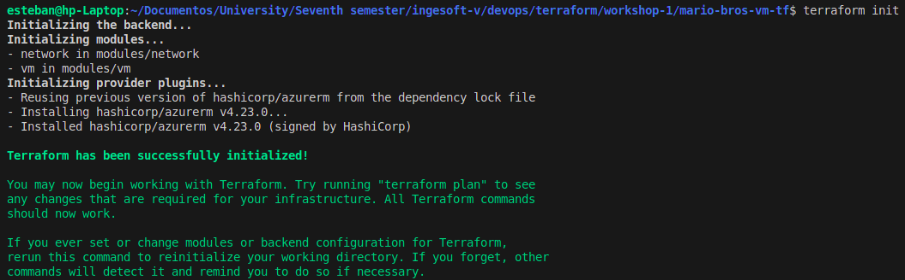
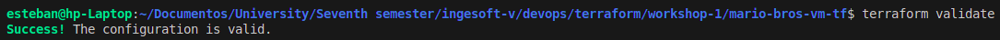
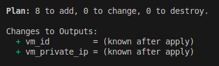
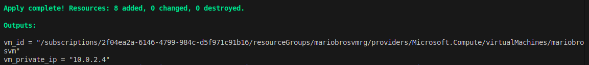

## Terraform Configuration Modularization

### 1. File Structure Transformation

The project has evolved from a monolithic structure with a single `main.tf` file to a modular architecture:

```
.
├── main.tf                 (Main configuration file)
├── modules
│   ├── network
│   │   ├── main.tf         (Network resources)
│   │   ├── outputs.tf      (Network module outputs)
│   │   └── variables.tf    (Network-specific variables)
│   └── vm
│       ├── main.tf         (Virtual machine resources)
│       ├── outputs.tf      (VM module outputs)
│       └── variables.tf    (VM-specific variables)
├── outputs.tf              (Optional, for root project outputs)
├── terraform.tfvars        (Variable values)
└── variables.tf            (Root variable definitions)
```

### 2. Responsibility Segregation

Resources have been logically divided into two modules with clearly defined responsibilities:

#### Network Module ([`modules/network`](./mario-bros-vm-tf/modules/network/main.tf))

- Contains all network-related resources:
    - Virtual network (`azurerm_virtual_network`)
    - Subnet (`azurerm_subnet`)
    - Public IP address (`azurerm_public_ip`)
    - Network interface (`azurerm_network_interface`)
    - Network security group (`azurerm_network_security_group`)
    - NSG association (`azurerm_network_interface_security_group_association`)

#### VM Module ([`modules/vm`](./mario-bros-vm-tf/modules/vm/main.tf))

- Contains virtual machine-related resources:
    - Linux virtual machine definition (`azurerm_linux_virtual_machine`)

### 3. Main Configuration File Changes ([`main.tf`](./mario-bros-vm-tf/main.tf))

The main configuration file is now significantly simplified:

- Retains the provider definition
- Maintains resource group creation
- Implements module calls instead of direct resource definitions
- Passes appropriate values to each module

### 4. Variable Management

- **Root Project Variables**: Remain unchanged, defined in `variables.tf` with values in `terraform.tfvars`
- **Module Variables**: Each module has its own `variables.tf` that specifies accepted parameters
- **Variable Passing**: The root project passes values to modules during invocation

### 5. Inter-Module Communication via Outputs

To facilitate communication between modules:

- The network module defines an output named `network_interface_id` that exposes the created network interface ID
- The root module passes this value to the VM module using:
  `network_interface_ids = [module.network.network_interface_id]`

### 6. Benefits of Modularization

1. **Maintainability**: Each module has a single, clear responsibility
2. **Reusability**: Modules can be reused across different projects
3. **Readability**: The main configuration file is cleaner and more comprehensible
4. **Scalability**: Easier to add new resources or modify existing ones without affecting the entire project
5. **Testability**: Facilitates independent testing of each component
6. **Collaboration**: Multiple team members can work on different modules simultaneously

### 7. Execution Workflow

#### Initialization and Validation

1. Initialize the working directory
    ```
    terraform init
    ```
   
2. Validate the configuration
    ```
    terraform validate
    ```
   
3. Plan the deployment
    ```
    terraform plan
    ```
   

#### Deployment Process

When executing `terraform apply`:



1. Terraform first creates the resource group
2. The network module is then executed, creating all network resources
3. Finally, the VM module is executed, which depends on the previously created network resources

This structured approach maintains the same variables and values as the original configuration but organizes them in a
more structured and modular manner.

Do not forget to destroy the resources at the end of this practice using `terraform destroy`.

##       