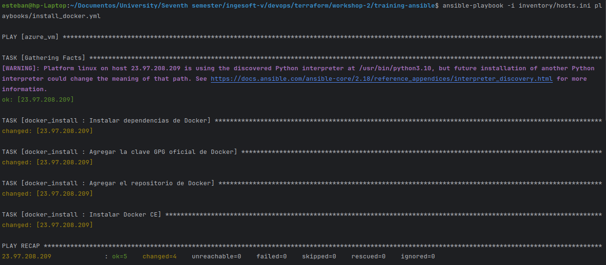
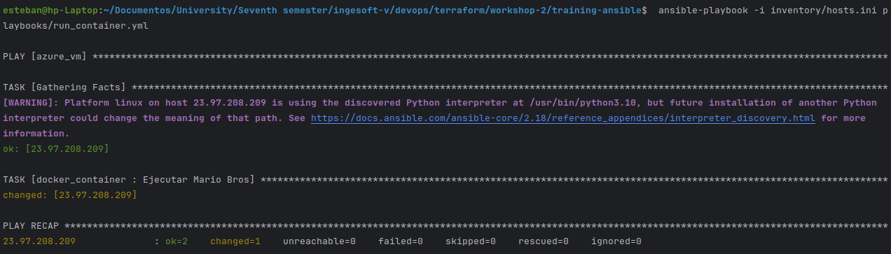
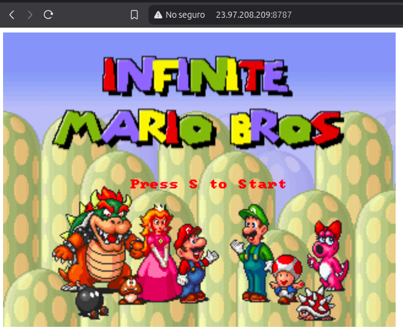

## Terraform Configuration Modularization

### 1. File Structure Transformation

The project has evolved from a monolithic structure with a single `main.tf` file to a modular architecture:

```
.
├── main.tf                 (Main configuration file)
├── modules
│   ├── network
│   │   ├── main.tf         (Network resources)
│   │   ├── outputs.tf      (Network module outputs)
│   │   └── variables.tf    (Network-specific variables)
│   └── vm
│       ├── main.tf         (Virtual machine resources)
│       ├── outputs.tf      (VM module outputs)
│       └── variables.tf    (VM-specific variables)
├── outputs.tf              (Optional, for root project outputs)
├── terraform.tfvars        (Variable values)
└── variables.tf            (Root variable definitions)
```

### 2. Responsibility Segregation

Resources have been logically divided into two modules with clearly defined responsibilities:

#### Network Module ([`modules/network`](./mario-bros-vm-tf/modules/network/main.tf))

- Contains all network-related resources:
    - Virtual network (`azurerm_virtual_network`)
    - Subnet (`azurerm_subnet`)
    - Public IP address (`azurerm_public_ip`)
    - Network interface (`azurerm_network_interface`)
    - Network security group (`azurerm_network_security_group`)
    - NSG association (`azurerm_network_interface_security_group_association`)

#### VM Module ([`modules/vm`](./mario-bros-vm-tf/modules/vm/main.tf))

- Contains virtual machine-related resources:
    - Linux virtual machine definition (`azurerm_linux_virtual_machine`)

### 3. Main Configuration File Changes ([`main.tf`](./mario-bros-vm-tf/main.tf))

The main configuration file is now significantly simplified:

- Retains the provider definition
- Maintains resource group creation
- Implements module calls instead of direct resource definitions
- Passes appropriate values to each module

### 4. Variable Management

- **Root Project Variables**: Remain unchanged, defined in `variables.tf` with values in `terraform.tfvars`
- **Module Variables**: Each module has its own `variables.tf` that specifies accepted parameters
- **Variable Passing**: The root project passes values to modules during invocation

### 5. Inter-Module Communication via Outputs

To facilitate communication between modules:

- The network module defines an output named `network_interface_id` that exposes the created network interface ID
- The root module passes this value to the VM module using:
  `network_interface_ids = [module.network.network_interface_id]`

### 6. Benefits of Modularization

1. **Maintainability**: Each module has a single, clear responsibility
2. **Reusability**: Modules can be reused across different projects
3. **Readability**: The main configuration file is cleaner and more comprehensible
4. **Scalability**: Easier to add new resources or modify existing ones without affecting the entire project
5. **Testability**: Facilitates independent testing of each component
6. **Collaboration**: Multiple team members can work on different modules simultaneously

### 7. Execution Workflow

#### Initialization and Validation

1. Initialize the working directory
    ```
    terraform init
    ```
   
2. Validate the configuration
    ```
    terraform validate
    ```
   
3. Plan the deployment
    ```
    terraform plan
    ```
   

#### Deployment Process

When executing `terraform apply`:


1. Terraform first creates the resource group
2. The network module is then executed, creating all network resources
3. Finally, the VM module is executed, which depends on the previously created network resources

This structured approach maintains the same variables and values as the original configuration but organizes them in a
more structured and modular manner.

Remember to destroy the resources at the end of this practice using `terraform destroy`.

## Ansible Implementation for Docker Container Deployment

### 1. Overview

This section describes the implementation of Ansible
to automate the deployment of a Docker container running Super Mario Bros on an Azure virtual machine.
The virtual machine was previously provisioned using the modularized Terraform configuration.

### 2. File Structure

The Ansible project follows a structured approach with clear separation of responsibilities:

```
.
├── ansible.cfg                               (Ansible configuration)
├── inventory
│   └── hosts.ini                             (Target hosts inventory)
├── playbooks
│   ├── install_docker.yml                    (Docker installation playbook)
│   └── run_container.yml                     (Container deployment playbook)
└── roles
    ├── docker_container                      (Container management role)
    │   └── tasks
    │       └── main.yml                      (Container tasks)
    └── docker_install                        (Docker installation role)
        └── tasks
            └── main.yml                      (Docker installation tasks)
```

### 3. Configuration Components

#### 3.1 Ansible Configuration (`ansible.cfg`)

The configuration file sets essential parameters for Ansible execution:

```ini
[defaults]
host_key_checking = False
roles_path = ./roles
inventory = ./inventory/hosts.ini
```

These settings:

- Disable SSH host key checking for seamless connections
- Define the path to roles directory
- Specify the default inventory file location

#### 3.2 Inventory Management (`inventory/hosts.ini`)

The inventory file defines the target Azure VM with connection parameters:

```ini
[azure_vm]
51.137.79.194 ansible_user = 'adminuser' ansible_ssh_pass='Password*#123'
```

This configuration:

- Creates a host group called `azure_vm`
- Specifies the VM's public IP address
- Provides SSH authentication credentials

### 4. Role-Based Task Organization

The implementation uses Ansible roles to organize related tasks logically:

#### 4.1 Docker Installation Role (`docker_install`)

This role contains tasks for setting up Docker on the target VM:

```yaml
- name: Instalar dependencias de Docker
  apt:
    name:
      - apt-transport-https
      - ca-certificates
      - curl
      - software-properties-common
    state: present
    update_cache: yes

- name: Agregar la clave GPG oficial de Docker
  ansible.builtin.apt_key:
    url: https://download.docker.com/linux/ubuntu/gpg
    state: present

- name: Agregar el repositorio de Docker
  ansible.builtin.apt_repository:
    repo: deb [arch=amd64] https://download.docker.com/linux/ubuntu bionic stable
    state: present

- name: Instalar Docker CE
  apt:
    name: docker-ce
    state: present
    update_cache: yes
```

The tasks perform these operations:

1. Installing Docker prerequisites
2. Adding Docker's official GPG key
3. Configuring the Docker repository
4. Installing Docker Community Edition

#### 4.2 Container Deployment Role (`docker_container`)

This role manages the Docker container deployment:

```yaml
- name: Ejecutar Mario Bros
  docker_container:
    name: supermario-container
    image: "pengbai/docker-supermario:latest"
    state: started
    ports:
      - "8787:8080"
```

The task:

1. Pulls the Super Mario Bros Docker image
2. Creates and starts a container named `supermario-container`
3. Maps port 8787 on the host to port 8080 in the container

**Important note**: For this process to work correctly, the virtual machine must have port **8787** exposed through a
security rule in the *Network Security Group* (NSG).
Below is an example of how to configure this rule:

```yaml
security_rule {
  name                       = "mario_bros_game_rule"
  priority                   = 110
  direction                  = "Inbound"
  access                     = "Allow"
  protocol                   = "Tcp"
  source_port_range          = "*"
  destination_port_range     = "8787"
  source_address_prefix      = "*"
  destination_address_prefix = "*"
}
```

This rule allows inbound traffic to port **8787** from any source IP address (`source_address_prefix = "*"`), enabling
access over the internet.

### 5. Playbook Implementation

The project uses two playbooks to orchestrate the deployment process:

#### 5.1 Docker Installation Playbook (`install_docker.yml`)

```yaml
---
- hosts: azure_vm
  become: yes
  roles:
    - docker_install
```

This playbook:

- Targets the `azure_vm` host group
- Elevates privileges with `become: yes`
- Applies the `docker_install` role

#### 5.2 Container Deployment Playbook (`run_container.yml`)

```yaml
---
- hosts: azure_vm
  become: yes
  roles:
    - docker_container
```

This playbook:

- Targets the `azure_vm` host group
- Elevates privileges with `become: yes`
- Applies the `docker_container` role

### 6. Execution Workflow

The deployment process follows this sequence:

1. **Prepare Environment**: Ensure SSH access to the Azure VM
2. **Install Docker**: Execute the Docker installation playbook
   ```bash
    ansible-playbook -i inventory/hosts.ini playbooks/install_docker.yml
   ```
   
3. **Deploy Container**: Execute the container deployment playbook
   ```bash
    ansible-playbook -i inventory/hosts.ini playbooks/run_container.yml
    ```
   
4. **Access Application**: The Super Mario Bros game becomes accessible via a web browser at
   `http://<vm-public-ip>:8787`
   

### 7. Security Considerations

The current implementation includes several security aspects that should be noted:

1. **Credentials in Plain Text**: The inventory file contains credentials in plain text, which is not recommended for
   production environments
2. **Privileged Execution**: Both playbooks run with elevated privileges (`become: yes`)
3. **Public Port Exposure**: The container exposes a port to the public internet

In a production environment, these aspects should be addressed using:

- Ansible Vault for credential encryption
- Principle of the least privilege for task execution
- Network security groups or firewalls to restrict port access

### 8. Benefits of This Approach

The Ansible implementation provides several advantages:

1. **Automation**: Eliminates manual steps in the deployment process
2. **Consistency**: Ensures identical setups across different environments
3. **Documentation as Code**: The playbooks serve as executable documentation
4. **Idempotency**: Playbooks can be run multiple times without side effects
5. **Integration**: Complements the Terraform infrastructure as code approach
